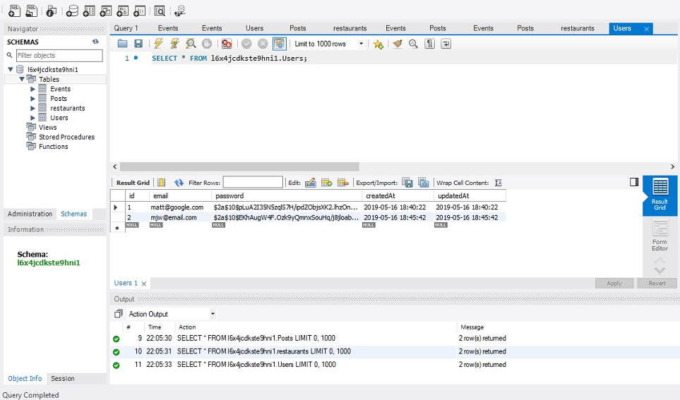
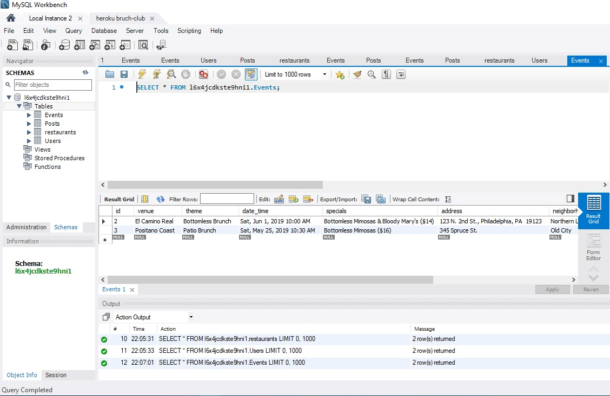
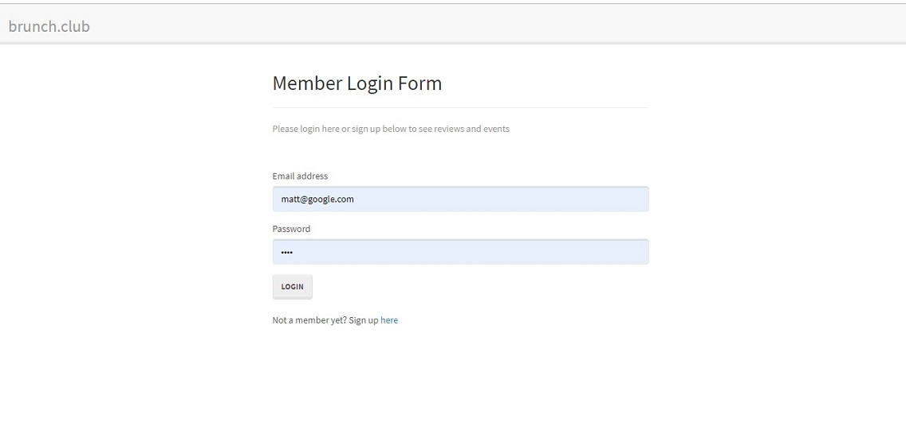
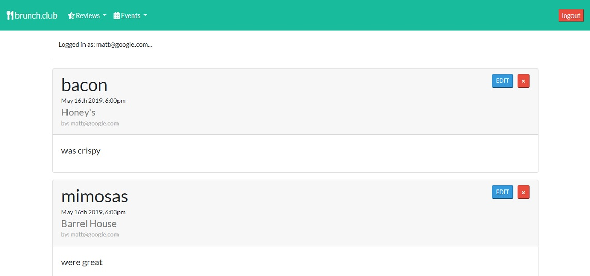
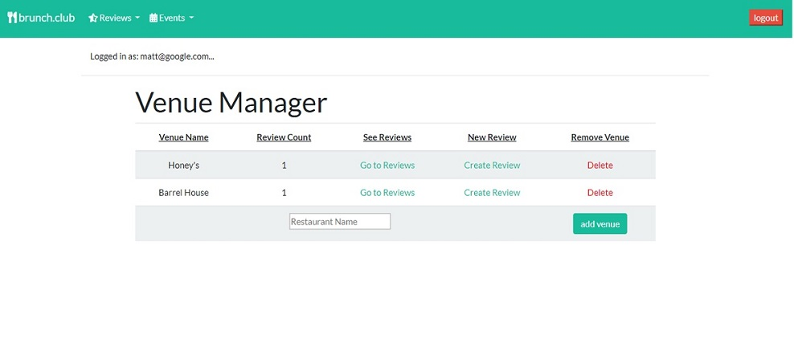
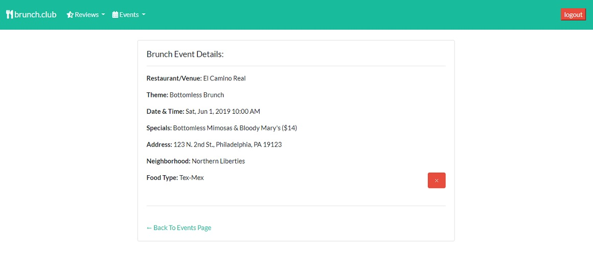
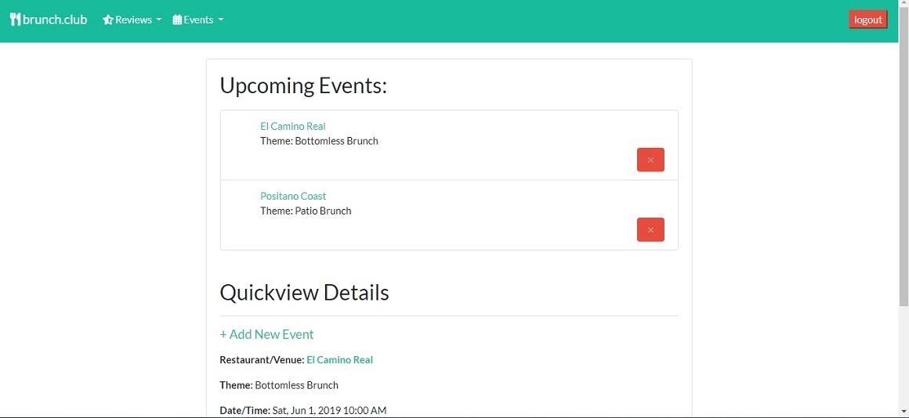
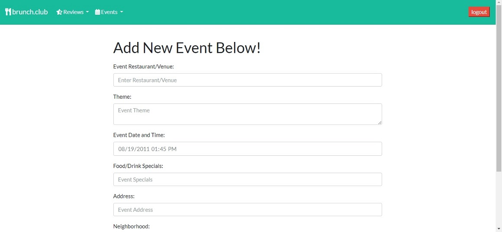
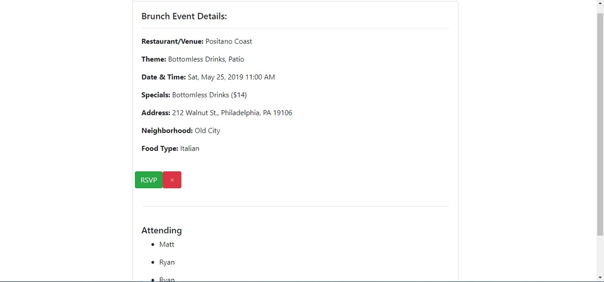

# BRUNCH CLUB! Group Project
___

For this group project, we worked in a small group to create a fully functioning application that could be any theme, that would use NodeJS server capabilities and an Express Web Server, backed by a Sequelize and a MySQL database, use GET and POST routes to retreive and create data, be actively deployed on heroku, and utilize a technology that we have not learned or worked with so far, which we chose the add-on Passport software for user authorization and password encryption.  This addition enabled us to add a log in/sign up entrance page to the application, have user-specific interactions, and also would store all of the user's information to the database as well.  The last requirements of the application was a polished front-end user interface, and the use of the MVC ("Model-View-Controller") layout paradigm for our folder structure.

Starting with the base code, we updated the information in the configuration file to match and connect to our local server, as well as the heroku hosted server, created a .gitignore and .env files for added sensitive information security, and the heroku JawsDB add-on for user info as well.  The same data from JawsDB was used to connect to a MySQL database so that information added on the site was also stored and updated in the database.

___

___

Our site used mainly a Bootstrap layout for the polished front end UI, and when users navigate to the Brunch Club site, they will first be brought to a log in page, where the user is able to either create a new account or login with an existing account.  This page, along with the 'restaurant/reviews' page was handled by Matt S. and Rick in our group, and a number of bugs arose here once we combined both of the HTML and API routes pages from Ryan and I's 'events' page.  A few duplicate routes were being called, which led to redirect errors.  Those were finally resolved with Bryan and Aaron's help, but on one of the heroku links submitted, the login page will need to be refreshed so that the user can log in and move to the reviews/blog page.  That issue did not show up running the app locally, but would show up after posted to heroku, so who knows?  Other than those couple bugs, the users and passwords will be saved to the SQL database, and the passwords are also hashed for the users protection.  The user is also able to see that they are correctly logged in on the top of the each page as well.

___

Moving to the reviews page, and throughout the site, the user is able to add restaurants to the database, create reviews for brunches at those restaurants, and then also are able to edit and delete -only their- reviews.  Those reviews and restaurants added to the site by the users are saved and stored to the SQL database.

___

___

___

Then navigating to the events page, the user is first able to view the next three upcoming events, and then also navigate to view all upcoming events.  The user has the ability to post new events to the page through the 'Add Event' link, which will also be saved to the database.  Ryan was able to include a RSVP button that would pop open a modal box to add the name and email of the user, and then add that person to the 'Attending:' list.  That functionality was working properly on our events branch, but was not able to be added to the hosted link, however, a screenshot of the working RSVP button fuctionality is provided below, and can easily be added in the future.  Some of the bugs encountered by Ryan and I coding the 'events' page was that each time an event was added, the values were saved and added to the database, but also an additional blank array was created as well.  This was solved with Bryan's help where there were two POST actions being called, one on our form and one from our API route that were creating both arrays.  Then also, there was a few bugs with combining the 'routes' and 'views' pages, as Ryan and I had used Express Handlebars to link to our html pages, and Rick and Matt S. did not, which led to some combining issues.

___

___

___

___

In the end, this app was very enjoyable to create, and in the future, is a site that we would like to continue moving forward with and adding even more functionality to.  This is mainly because a focused app strictly on brunch is something I think people would actually use, and also a site basically created by user reviews and events can be trusted for its honesty.  Also, further expansion of the site could include restaurants being able to sponsor brunch events, and allowing users to save and/or share restaurants, reviews and/or events.

## Built With

* [HTML5]
* [CSS3]
* [JavaScript]
* [jQuery]
* [Node JS]
* [Express]
* [Express Handlebars](https://www.npmjs.com/package/express-handlebars) - Handlebars View Engine
* [Express Session](https://www.npmjs.com/package/express-session) - Log In/Sign Up, simple session middleware for Express
* [MySQL]
* [Sequelize](https://www.npmjs.com/package/sequelize) - Sequelize is a promise-based Node.js ORM for Postgres, MySQL, MariaDB, SQLite and Microsoft SQL Server
* [Heroku](https://salty-tor-68629.herokuapp.com/events) - Hosted Project Site
* [Passport](http://www.passportjs.org/) - Passport is authentication middleware for Node.js
* [MVC](https://www.tutorialsteacher.com/mvc/mvc-folder-structure) - Folder framework used

## Authors

* **Matt Williams** - *Initial work* - [M Williams Portfolio](https://mattwills09.github.io/portfolio.html)

See also the list of Contributors who participated in this project:

## Contributors

[Matthew Senso]
[Rick Nicolai]
[Ryan Jamison]
